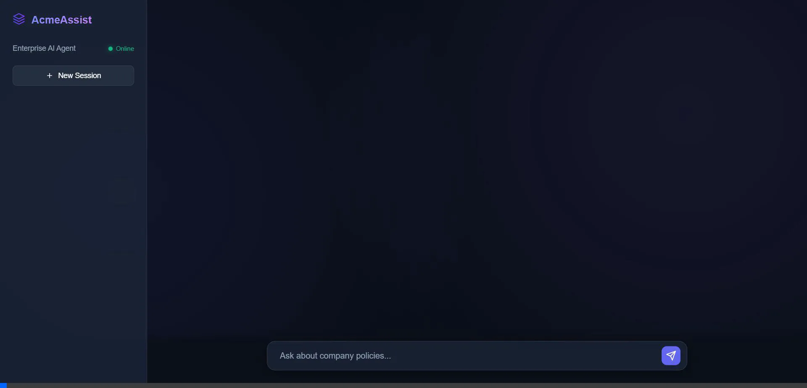
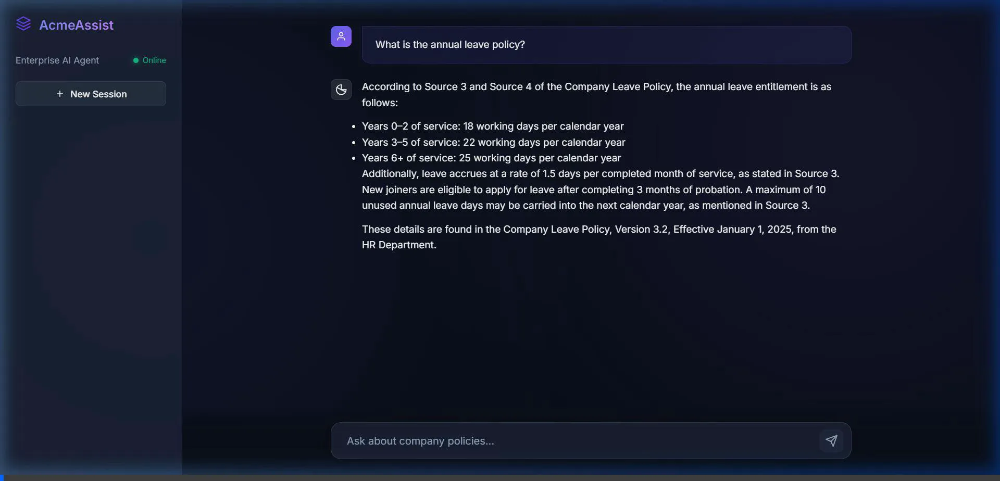

# AcmeAssist — AI Enterprise Agent with RAG & UI

> An intelligent internal assistant for Acme Corporation employees, featuring a premium Glassmorphic Single-Page Application, powered by Groq (Llama 3 70B) and structured Retrieval-Augmented Generation (RAG).

[](https://python.org)
[](https://fastapi.tiangolo.com)
[](https://groq.com)
[](https://huggingface.co/sentence-transformers/all-MiniLM-L6-v2)
[](https://aws.amazon.com)
[](https://vercel.com)

---

## 📸 Visual Design

AcmeAssist includes a meticulously crafted frontend running directly off the API via Vanilla JS and pure CSS (zero heavy JS frameworks required).
- **Glassmorphism:** Transluecent overlays, gradient meshes, and deep aesthetic typography.
- **Micro-Animations:** Seamless transitions natively supported in the app.
- **RAG Architecture Visualization:** Chips linking directly to source documents that answered the queries!

### Project Live Demo


### Full Conversation Capability


---

## 🏗️ Architecture Overview & Tech Stack

```
┌─────────────────────────────────────────────────────────────────┐
│                        User / Web Browser                       │
└─────────────────────┬───────────────────────────────────────────┘
                      │ POST /ask  {query, session_id}
                      ▼
┌─────────────────────────────────────────────────────────────────┐
│                    FastAPI Backend (App Service)                 │
│                                                                 │
│  ┌─────────────────────────────────────────────────────────┐   │
│  │                    Agent Core Loop                       │   │
│  │                                                         │   │
│  │  1. Load session memory (conversation history)          │   │
│  │  2. Call Groq API via standard OpenAI SDK               │   │
│  │  ┌──────────────────────────────────────────────────┐  │   │
│  │  │  Tool Call? search_documents(query)               │  │   │
│  │  │         │                                        │  │   │
│  │  │         ▼                                        │  │   │
│  │  │  ┌─────────────┐   ┌──────────────────────────┐ │  │   │
│  │  │  │  Embed Query │──▶│   FAISS Vector Search    │ │  │   │
│  │  │  │(all-MiniLM)│   │   (cosine similarity)    │ │  │   │
│  │  │  └─────────────┘   └──────────┬───────────────┘ │  │   │
│  │  │                               │ top-k chunks     │  │   │
│  │  │                               ▼                  │  │   │
│  │  │              Inject context into prompt           │  │   │
│  │  └──────────────────────────────────────────────────┘  │   │
│  │  3. Final LLM call → structured answer                  │   │
│  │  4. Save to session memory                              │   │
│  └─────────────────────────────────────────────────────────┘   │
│                                                                 │
└─────────────────────┬───────────────────────────────────────────┘
                      │ {answer, source, session_id}
                      ▼
                   Web Browser
```

| Component | Technology | Purpose |
|-----------|-----------|---------|
| **Frontend UI** | HTML / CSS / Vanilla JS | Glassmorphic interface with markdown parser |
| **API Framework** | FastAPI 0.115 | REST API, async serving, OpenAPI docs |
| **LLM Inference** | Groq (Llama-3.3-70b-versatile) | Reasoning and intelligence pipeline |
| **Embeddings** | all-MiniLM-L6-v2 | Local zero-cost embedding via `sentence-transformers` |
| **Vector Indexing** | FAISS | In-memory extreme speed cosine similarity search |
| **Memory** | In-memory Session Dict | Conversation continuity mechanism |
| **Backend Deployment**| AWS Elastic Beanstalk (AL2 Docker) | Cloud API engine |
| **Frontend Proxy** | Vercel | Connects UI to the AWS securely with proxy rewrites |

---

## 📂 Project Structure

```text
agent/
├── app/
│   ├── main.py              # FastAPI app + lifespan startup (serves UI)
│   ├── config.py            # Settings (supports Groq)
│   ├── api/
│   │   └── routes.py        # POST /ask, GET /health
│   ├── agent/
│   │   ├── core.py          # Agent reasoning loop
│   │   ├── memory.py        # Session memory manager
│   │   ├── prompts.py       # System prompts
│   │   └── tools.py         # Tool definitions + executor
│   ├── rag/
│   │   ├── loader.py        # Document loading (txt, pdf)
│   │   ├── embeddings.py    # Local sentence-transformer wrapper
│   │   ├── indexer.py       # FAISS index builder
│   │   └── retriever.py     # Similarity search
│   └── models/
│       └── schemas.py       # Pydantic request/response schemas
├── documents/               # Sample company documents (5 files)
├── scripts/
│   └── index_documents.py   # CLI: builds the FAISS index
├── static/                  # Frontend UI files (CSS, JS, index.html)
├── tests/                   # Unit + integration tests
├── vectorstore/             # Generated index
├── .env.example             # Environment variable template
├── Dockerfile               # Container definition
├── docker-compose.yml       # Local Docker Compose & AWS Route binding
├── vercel.json              # Vercel proxy rewrite configuration
└── requirements.txt
```

---

## ⚡ Deployment Instructions

### Option 1: Quick Local Launch

1. **Clone & Install**
   ```bash
   git clone <your-repo>
   cd agent
   pip install -r requirements.txt
   ```
2. **Setup Groq**
   - Create a `.env` file and set `GROQ_API_KEY=gsk_your_api_key_here`.
3. **Compile the Local Vector Database**
   ```bash
   python scripts/index_documents.py
   ```
4. **Boot Up Server**
   ```bash
   uvicorn app.main:app --reload
   ```
5. **Visit `http://localhost:8000` to see the Agent UI live!**

### Option 2: Run via Docker (Local)

```bash
# Build and start (Groq key in .env file)
docker-compose up --build

# Or pass key directly
GROQ_API_KEY=gsk-... docker-compose up --build
```

### Option 3: AWS Elastic Beanstalk (Hosting)
The backend is Dockerized and production-ready for AWS Elastic Beanstalk configuration.
1. Make sure you have the `awsebcli` installed.
2. Initialize app with `eb init`.
3. Create environment using `eb create acme-agent-app` (using the `.ebextensions` provided to mount the 20GB root volume + 2GB swap space required for ML).
4. Expose environment variable with `eb setenv GROQ_API_KEY=your_key`.
5. AWS NGINX reverse-proxy seamlessly attaches to the container port utilizing `docker-compose.yml`.

### Option 4: Vercel Cloud (Frontend Hosting)
The UI can be entirely decoupled from the AWS layer using the `vercel.json` rewrite file included in the root context.
Simply push your repository to GitHub, and import it into **Vercel** via the Vercel Dashboard! 
The rewrites will securely proxy all frontend fetches to the deployed Elastic Beanstalk URL bypassing HTTP mixed-content protocols.

---

## 📘 API Reference

### `POST /ask`

Submit a question to the AI agent.

**Request:**
```json
{
  "query": "What is the company's annual leave entitlement?",
  "session_id": "optional-string-for-conversation-continuity"
}
```

**Response:**
```json
{
  "answer": "According to the Leave Policy...",
  "source": ["company_leave_policy.txt"],
  "session_id": "abc-123"
}
```

### `GET /health`

Health check required for AWS Application Load Balancers.

**Response:**
```json
{
  "status": "ok"
}
```

---

## 🔬 Design Decisions

### Why Groq + Local Embeddings? (Zero-Cost Architecture)
To overcome cloud billing limits natively, I adapted the architecture to be 100% cost-free while maintaining standard OpenAI usage patterns.
1. The `base_url` points to **Groq**. This allows the exact same code execution, but powered by Groq's blazing-fast LPUs using Llama 3 models.
2. For embeddings, I swapped out OpenAI's embeddings for completely local open-weights models (`sentence-transformers/all-MiniLM-L6-v2`) processing heavily in Docker.

### Why AWS Elastic Beanstalk?
Deployed to Elastic Beanstalk via Free Tier `t3.micro`. Includes dynamic disk swaps mapped natively within `.ebextensions` ensuring the FAISS + Vector layers succeed fully in the cloud environment.

### Why custom agent loop instead of LangChain?
LangChain adds significant abstraction overhead. A custom loop is simpler to debug, easier to explain in interviews, and is only ~80 lines of code. It uses Groq API's native function calling, which is the industry standard.

### Why FAISS instead of a cloud vector database?
FAISS runs entirely in-memory with zero infrastructure requirements. For this assignment's scale, it's the perfect choice. 

---

## 📑 Sample Documents Included

| File | Topic |
|------|-------|
| `company_leave_policy.txt` | Annual, sick, maternity, paternity, bereavement leave |
| `employee_handbook.txt` | Code of conduct, benefits, working hours, performance |
| `it_security_guidelines.txt` | Password policy, VPN, data classification |
| `product_faq.txt` | FlowDesk Pro pricing, features, SLA, integrations |
| `remote_work_policy.txt` | Eligibility, equipment, expenses, availability standards |

---

*Built for the AI Engineer Assignment — Acme Corporation Internal Assistant*
